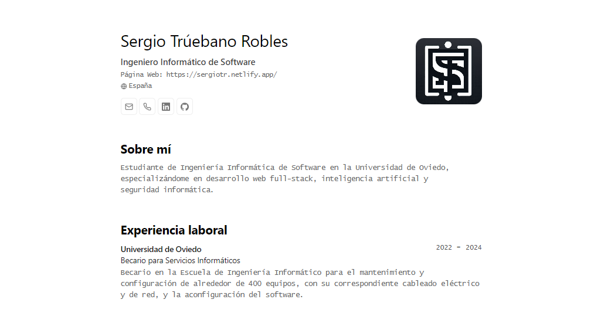

<div align="center">
 
<h2>
    <em>Portafolio minimalista</em> maquetado para web y pdf
</h2>
<p>
Esquema del JSON de CV de <a href="https://jsonresume.org/schema/">jsonresume.org</a>
</p>


<p>
Basado en el diseño de <a href="https://github.com/BartoszJarocki/cv">Bartosz Jarocki</a>

</p>

</div>

<div align="center">
    <span>&nbsp;✦&nbsp;</span>
    <a href="https://sergiotr.netlify.app">
        Personal
    </a>
    <span>&nbsp;✦&nbsp;</span>
   
</div>

<p></p>

<div align="center">

</div>

</img>

## 🛠️ Stack

- [**Astro**](https://astro.build/) - El framework web de la nueva época para aplicaciones estáticas.
- [**Typescript**](https://www.typescriptlang.org/) - JavaScript con sintaxis de tipado.
- [**Ninja Keys**](https://github.com/ssleptsov/ninja-keys) - Menú desplegable con atajos de teclado hecho en puro Javascript.


## 🚀 Empezar

### 1. Usa este [repo](https://github.com/sergio-tr/portfolio-json) como _template_ de un proyecto de Astro y usa un _gestor de dependencias_:


- [pnpm](https://pnpm.io/installation) 
- [npm](https://nodejs.org/en)
- [bun](https://bun.sh/) 

```bash
# Activa pnpm en MacOS, WSL & Linux:
corepack enable
corepack prepare pnpm@latest --activate

pnpm create astro@latest -- --template sergio-tr/portfolio-json
```

### 2. Añade tu contenido:
Edita el archivo `cv.json` para crear tu propio Portafolio/CV imprimible.
Añade Iconos en la carpeta `src/icons` con el mismo nombre que se usa en el archivo `cv.json` e impórtalos en `src/components/Skills.astro`

### 3. Lanza el entorno de desarrollo:

```bash
pnpm dev
```


1. Abre [**http://localhost:4321**](http://localhost:4321/) en tu navegador para ver el resultado 🚀


## 🧞 Comandos

|     | Comando          | Acción                                        |
| :-- | :--------------- | :-------------------------------------------- |
| ⚙️  | `dev` o `start` | Lanza un servidor de desarrollo local en  `localhost:4321`.  |
| ⚙️  | `build`          | Comprueba posibles errores y hace un empaquetado de producción en `./dist/`.      |
| ⚙️  | `preview`        | Vista previa en local `localhost:4321` |


## 🔑 Licencia

[MIT](LICENSE.txt) - Creado por [**sergio-tr**](https://sergiotr.netlify.app).


